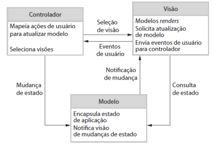
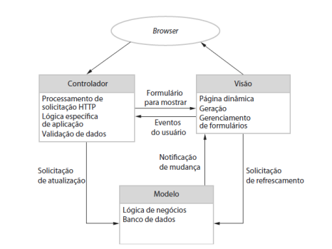
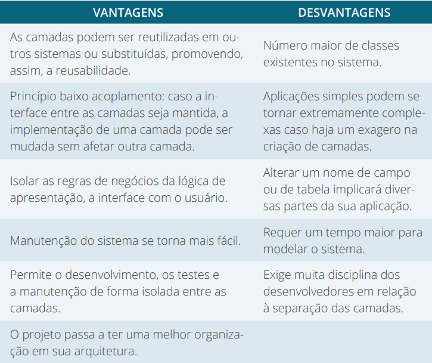
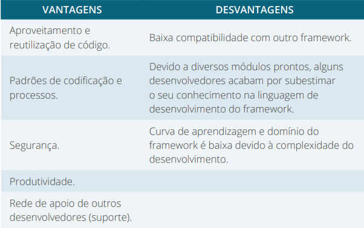
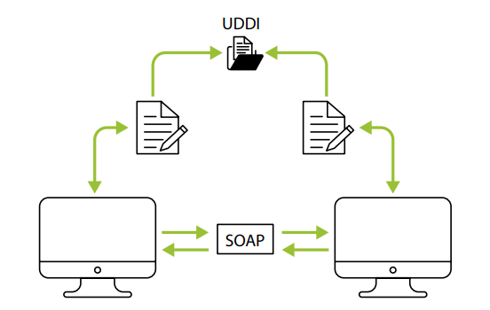
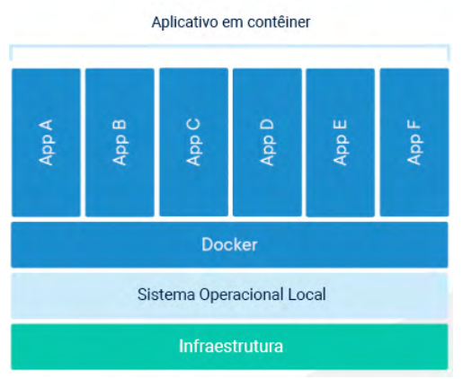
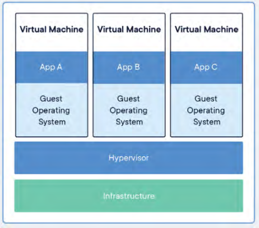

# Tópicos

- [Conceitos MVC](#Conceitos-mvc)
- [Frameworks](#Frameworks)
- [Webservice e API RESTFUL](#Webservice-e-API-RESTFUL)
- [Princípios de Docker](#Princípios-de-Docker)

# Conceitos mvc

Nesta aula, trabalharemos com um conceito de desenvolvimento em camadas, o
MVC. Durante o desenvolvimento, é necessário que diversos passos sejam executados para que ele possa ter uma qualidade eficaz, ou seja, é necessário que se
tenha um roteiro que o software precisa seguir de acordo com suas necessidades,
e este passo é chamado de Processo de Software (PRESSMAN; MAXIM, 2016).
Para Sommerville (2011, p. 18), existem diversos processos de software diferentes, mas todos devem incluir quatro atividades que são consideradas fundamentais para a Engenharia de Software:

1. **Especificação de software**. A funcionalidade do software e as restrições a seu funcionamento devem ser definidas.
2. **Projeto e implementação de software**. O software deve ser produzido para atender às especificações.
3. **Validação de software**. O software deve ser validado para garantir
que atenda às demandas do cliente.
4. **Evolução de software**. O software deve evoluir para atender às
necessidades de mudança dos clientes

> Fonte: ALVES, F. Modelos de Aplicação do Back End. In: Bezzera, 2007 **Programação back end II**. 22.ed. Maringa, PR: Centro Universiário de Maringá, 2019. p. 203

Contudo, Pressman e Maxim (2016) afirmam que, para que o desenvolvimento de
software possa alcançar o resultado final, é necessário que se tenha uma arquitetura
de software condizente com o processo. Algumas delas são: **arquitetura centralizada
em dados**; **arquitetura de fluxo de dados**; **arquitetura de chamada e retorno**; **arquitetura orientada a objetos**; **arquitetura em camadas**; e **arquitetura MVC**. 

De acordo com Pressman e Maxim (2016, p. 230):

> A arquitetura de software de um programa ou sistema computacional é
a estrutura ou estruturas do sistema, que abrange os componentes de
software, as propriedades externamente visíveis desses componentes e
as relações entre eles

Dentre as arquiteturas citadas anteriormente, aprofundaremos nossos conhecimentos na arquitetura MVC, sendo esta a mais utilizada para o desenvolvimento
de sistemas Web. Esta, por sua vez, tem por objetivo auxiliar os desenvolvedores
a construir aplicações, separando seus principais componentes. Essa separação
ocorre com a manipulação e armazenamento dos dados (**Model**), as funções que
trabalharão com as entradas dos dados (**Controller**) e a visualização do usuário
(**View**). Estudaremos cada uma dessas camadas ou componentes separadamente.

A camada **Model** contém toda a comunicação com os dados armazenados
que serão visualizados na camada View, que podem estar armazenados em um
banco de dados, em um JSON, em um arquivo XML, em um arquivo, entre outros locais. Toda a manipulação de dados acontece em um SGBD (comandos de
manipulação: create, reader, update e delete), o famoso (CRUD), com um banco
de dados relacional, ou não deve ocorrer nesta camada, ou seja, é ela que conterá
um maior nível de abstração do sistema.

A camada **View** trabalha apenas com a apresentação dos dados da aplicação,
passando ao usuário final uma confiança de que tudo está se realizando no seu terminal. É nesta camada que se tem os frameworks de front-end, templates, entre outros.

Enquanto isso, a camada **Controller** é responsável por administrar todo o
fluxo da aplicação. Nesta camada, é onde ocorre toda a movimentação da aplicação, ou seja, a partir da entrada de uma View, ela resolve qual operação utilizará
da camada Model e, assim, devolverá a sua View correspondente junto aos dados.
Confira, na figura a seguir, o fluxo de dados da arquitetura MVC.

> Figura 1 - A organização do MVC / Fonte: Sommerville (2011, p. 109).

De forma análoga, a aplicação do MVC para WEB não é tão diferente, altera-se
apenas o tipo de fluxo, como podemos perceber na Figura 2.

> Figura 2 - Arquitetura de aplicações Web usando o padrão MVC
Fonte: Sommerville (2011, p. 110)

Como em toda arquitetura, o MVC possui algumas vantagens e desvantagens.
Veja, no quadro a seguir, alguns apontamentos:

> Quadro 1 - Vantagens e desvantagens da arquitetura MVC / Fonte: os autores.

Não há uma receita de bolo que indique a melhor arquitetura a se utilizar, pois
sempre que um sistema for desenvolvido, terá, com certeza, a necessidade de
manutenção, como melhorias ou correção de erros, e, também, pode necessitar
de várias atualizações. Assim, o MVC vem a calhar com a manutenção exclusiva
das camadas da aplicação.

> Fonte: ALVES, F. Modelos de Aplicação do Back End. In: Bezzera, 2007 **Programação back end II**. 22.ed. Maringa, PR: Centro Universiário de Maringá, 2019. p. 204-206

# Frameworks

A partir do que foi estudado na aula anterior sobre o MVC, é necessário que
se mantenha uma qualidade de desenvolvimento, possibilitando um benefício
para o resultado final. Nesse viés, o framework consiste em uma boa prática de
desenvolvimento, pois, para desenvolver uma aplicação — seja ela web, desktop
ou mobile — completamente do zero, tem-se uma tarefa árdua que requererá
mais tempo de trabalho.

Para Sommerville (2011, p. 299), um framework de aplicações é considerado
“**coleções de classes abstratas e concretas [que] são adaptadas e estendidas para
criar sistemas de aplicação**”. Em outras palavras, podemos entender que os frameworks funcionam como uma **biblioteca de arquivos** que armazena diversas
funções básicas para o desenvolvimento de uma aplicação.

Os frameworks, para o desenvolvimento, diminuem o tempo gasto e o nível
de complexidade por não ser necessário reinventar códigos, pois eles já implementam diversas funções de forma automática. Cada linguagem de programação
tem os seus respectivos frameworks, que podem ser utilizados, dependendo do
objetivo do seu sistema, da equipe, do tempo de desenvolvimento, da manutenibilidade, entre outros.

Contudo, como toda boa tecnologia, temos algumas vantagens e desvantagens em um framework para desenvolvimento WEB. Confira:

Quadro 2 - Vantagens e desvantagens em trabalhar com frameworks / Fonte: os autores.

> Fonte: ALVES, F. Modelos de Aplicação do Back End. In: Bezzera, 2007 **Programação back end II**. 22.ed. Maringa, PR: Centro Universiário de Maringá, 2019. p. 207-208

### Frameworks de desenvolvimento WEB no front-end 

Sabemos que o front-end é quem atua nas interfaces, mostrando o que o usuário
solicitou e gerenciando as telas que são apresentadas. Nesse contexto, os frameworksfront-end servem como ferramentas que auxiliam na criação de interfaces
e na forma como os dados são exibidos.

Atualmente, temos à disposição diversos frameworks, assim falaremos, a seguir, sobre alguns dos mais utilizados no mercado de trabalho.

- **Angular**: esse é um framework JavaScript que implementa a arquitetura
MVC e é de código aberto. Mantido pela Google, ele é ideal para criar
aplicativos web avançados de uma única página, mais conhecidos como
SPA (sigla para Single Page Applications, ou Aplicações de Página Única).
Com o Angular, podemos desenvolver aplicações web voltadas tanto para
resoluções desktop quanto para resoluções mobile, tornando-as dinâmicas, modernas e escaláveis (ANGULAR, [2021], on-line)¹.

- **React**: trata-se de uma biblioteca JavaScript para criar interfaces de
usuário para se utilizar no front-end, embora possa ser considerada
uma estrutura por implementar conceitos de componentes. React foi
o primeiro framework a usar arquitetura baseada em componentes,
sendo o seu maior diferencial a rapidez do uso e a facilidade para
aprender. Esse framework foi desenvolvido e é mantido pelo Facebook. Como a lógica do componente é escrita em JavaScript e não
em templates, você pode facilmente passar diversos tipos de dados ao
longo da sua aplicação e ainda manter o estado fora do DOM (REACT,
[2021], on-line)². 

- **React Native**: é um framework baseado no React JS, desenvolvido pela
equipe do Facebook, que possibilita o desenvolvimento de aplicações
mobile tanto para Android como para iOS, utilizando apenas JavaScript. No React Native, todo código desenvolvido deve ser convertido
para a linguagem nativa do sistema operacional, o que torna o app
muito mais fluido.

- **Vue**: é um framework progressivo para a construção de interfaces de
usuário. Ao contrário de outros frameworks monolíticos, Vue foi projetado desde a sua concepção para ser adotável incrementalmente. A
biblioteca principal é focada exclusivamente na camada visual (view
layer), sendo fácil adotar e integrar com outras bibliotecas ou projetos existentes. Por outro lado, Vue também é perfeitamente capaz de
dar poder a sofisticadas Single Page Applications quando usado em
conjunto com ferramentas modernas e bibliotecas de apoio (VUE.JS,
[2021], on-line)³. 

- **Bootstrap**: é uma framework gratuito para desenvolvimento HTML,
CSS e JS com a tecnologia mobile (responsivo), desenvolvido pelo
Twitter em 2010. O Bootstrap possui uma diversidade de componentes (plug-ins) em JavaScript (jQuery) que auxiliam o designer a implementar tooltip, menu-dropdown, modal, carousel, slideshow, entre
outros, sem a menor dificuldade, apenas acrescentando algumas configurações ao código, sem a necessidade de criar scripts e mais scripts.
Bootstrap é um framework CSS utilizado em aplicações front-end, ou
seja, na camada de interface com o usuário para o desenvolvimento
de aplicações adaptáveis à tela de qualquer dispositivo.

### Frameworks de desenvolvimento WEB no back-end

O back-end de uma aplicação trabalha com a toda a lógica do sistema, seja no
controle de rotas, cálculos ou comunicação das informações trocadas entre banco
de dados e navegador. Ele é considerado o centro de processamento, uma vez que
se relaciona diretamente com o front-end. O back-end não é visto pelo usuário
externo. O uso de um framework voltado para o back-end facilita e agiliza o
desenvolvimento da aplicação.

A seguir, conversaremos um pouco sobre alguns dos que são usados no mercado de trabalho

- **Laravel**: é um framework PHP utilizado para o desenvolvimento web
e faz uso da arquitetura MVC. Ele tem como principal característica
desenvolver aplicações seguras e performáticas de forma rápida, com
código limpo e simples. O Laravel faz uso da arquitetura de desenvolvimento MVC (Model, View, Controller) e do padrão de desenvolvimento PSR-2, que tem como foco a escrita de código limpo e
com boa legibilidade. Além disso, o framework tem como objetivo
aumentar a velocidade de codificação, sem esquecer características
importantes, como a segurança e performance da aplicação. O Laravel
utiliza o Composer para gerenciar suas dependências. O Composer é
um gerenciador de dependências, ou seja, uma ferramenta que permite
gerenciar de forma fácil os pacotes de terceiros da sua aplicação. O
Laravel possui um sistema de template que facilita a criação da camada
de visualização de dados (páginas HTML).

- **Zend PHP**: é um framework orientado a objetos, baseado em MVC,
que permite que você carregue apenas componentes que deseja como
bibliotecas individuais. Em outras palavras, o Zend permite que você
foque apenas nos componentes e funções que você deseja e ignore
todo o resto. Ele segue os padrões PHP-FIG e foca nos critérios de
segurança, como o armazenamento de senhas, usando o recurso de
bcrypt ou gerando criptografia usando AES. O Zend também é a mantenedora da linguagem PHP.

Existem outros frameworks php, tais como: cakePhp, Symfony, Phalcon, CodeIgniter, Sline, entre outros.

> Fonte: ALVES, F. Modelos de Aplicação do Back End. In: Bezzera, 2007 **Programação back end II**. 22.ed. Maringa, PR: Centro Universiário de Maringá, 2019. p. 208-210

# Webservice e API RESTFUL

Para entender o funcionamento e a necessidade de um WebService, imagine dois
sistemas totalmente diferentes e que necessitem, de alguma forma, trocar informações constantemente. Essas informações, normalmente, são coletadas por um
usuário e introduzidas em um outro sistema, ou, ainda, podem ser manipuladas e
exportadas em arquivos como: JSON, XML, entre outros.. Nesse processo, podem
ocorrer atrasos, perdas de informações, deixando a aplicação suscetível a erros. 

O **XML (Extensible Markup Language)** é uma linguagem de marcação criada pelo W3C,
e ela oferece uma certa padronização, flexibilidade e a possibilidade de descrever classes com diversos tipos de dados, reduzindo significativamente os custos de desenvolvimento (XML, W3C).

Analisando a situação anterior, temos um problema que pode ser resolvido
com a aplicação de um Web Service. Ele é um conjunto de métodos que são
acessados por outros programas ao utilizar tecnologias Web. Dessa forma,
quando for necessário trocar informações entres os sistemas, basta executar o
Web Service ou, ainda, deixar programada a troca de informações. Essa troca
de informação é muito útil, pois vem ao encontro da necessidade de se ter uma
interoperabilidade entre sistemas (W3C, [2021]).

Como o Web Service é uma tecnologia Web, logo deve ser desenvolvido
utilizando-se de tecnologias de desenvolvimento Web, tais como: PHP, Java,
Nodejs, entre outros. Para transferir dados entre as aplicações, são utilizados
protocolos de comunicação WEB (http) (JOSUTTIS, 2007).

Além de trocas informação, um Web Service pode incluir novas funcionalidades na aplicação sem ser necessário realizar manutenções na aplicação. Esta ação é muito importante quando se tem um software legado e que
necessite incluir uma nova funcionalidade, uma vez que já não é tão trivial
desenvolver para essas aplicações de forma simples e rápida.

Agora, vejamos como funciona um Web Service. A aplicação A solicita
uma operação no WebService, ele efetua o processamento e envia os dados
para a aplicação que requereu a operação por meio de protocolos web. A
aplicação recebe os dados e faz a sua interpretação, convertendo-os para a
sua linguagem própria.

Normalmente, esses sistemas WebService foram desenvolvidos em linguagens de programações distintas, assim será necessária uma linguagem
intermediária que garanta a comunicação entre a linguagem do Web Service
e o sistema que faz o pedido ao Web Service.

No mercado, já existem protocolos de comunicação como o **SOAP (Simple
Object Access Protocol)** e o **REST (Representational State Transfer)** (JOSUTTIS, 2007). Vejamos esses protocolos a seguir.

> Fonte: ALVES, F. Modelos de Aplicação do Back End. In: Bezzera, 2007 **Programação back end II**. 22.ed. Maringa, PR: Centro Universiário de Maringá, 2019. p. 217-218

### Protocolo REST

O REST (**Representational State Transfer**) é um protocolo de comunicação
que se baseia no protocolo HTTP, ou seja, transmite os dados diretamente
via protocolo HTTP por meio da Web Semântica. Permite, também, utilizar
vários formatos para representação de dados, como JSON, XML, RSS, entre
outros, permitindo uma flexibilidade e não limitando os formatos de representação de dados (W3C).

### Protocolo SOAP 

O protocolo SOAP (Simple Object Access Protocol) utiliza a linguagem XML
para enviar mensagens e, geralmente, serve-se do protocolo HTTP para transportar os dados. Esse protocolo possibilita a passagem de comandos e parâmetros entre as entidades Requester e Provider, respectivamente, requerente
e provedora (JOSUTTIS, 2007).

Associado ao protocolo SOAP, está o documento **WSDL** (**Web Service
Definition Language**), que é uma linguagem de metadados utilizada nesses
documentos que descreve a localização do Web Service e as operações de
que dispõe. Um documento WSDL define um XML para descrever o serviço
Web entre a interface de um serviço e as operações suportadas. Esse XML
especificará os formatos de dados e protocolos específicos que serão utilizados
(JOSUTTIS, 2007).

Além do WSDL, o SOAP necessita do **UDDI** (**Universal Description, Discovery, and Integration**), que é um diretório de serviço em que os sistemas
podem registrar e procurar por serviços, ou seja, é um framework para disponibilizar, utilizar e pesquisar por serviços na internet (JOSUTTIS, 2007).
Confira o fluxo do SOAP na Figura 9 a seguir.

> Figura 9 - Fluxo do SOAP / Fonte: os autores.

A partir desses conceitos de Web Service, podemos entender melhor os conceitos
de API RestFull. Este termo une dois conceitos que já trabalhamos no decorrer
do livro, API e Rest. Apenas relembrando, uma API são os conjuntos de instruções produzidas em uma linguagem de programação — que, no nosso caso, até
aqui, foi o PHP — e que servem para fornecer dados e informações relevantes
de uma determinada aplicação. O Rest trabalha com web semântica, por meio
de metadados, e tem linguagem própria.

Vamos a um exemplo de aplicação de uma API. Quando você vai logar em um
serviço na Web ou realizar algum cadastro, e ele te dá a possibilidade de se logar
com os serviços do Gmail, do Facebook ou outro serviço, provavelmente, estamos utilizando uma API RestFull. Nesse caso, a API fica esperando a solicitação
request, realiza o processamento dos metadados recebidos e realiza a devolução
das informações por meio de um Json ou XML e atualiza a tela do solicitante.

> Fonte: ALVES, F. Modelos de Aplicação do Back End. In: Bezzera, 2007 **Programação back end II**. 22.ed. Maringa, PR: Centro Universiário de Maringá, 2019. p. 219-220

# Princípios de Docker

Olá, aluno(a)! Abordaremos um conceito
que vem, ao longo dos anos, concretizando-
-se no setor de desenvolvimento, o Docker.
Ele é uma plataforma de código-fonte aberto, criado pela própria
Docker.Inc em 2013, e foi desenvolvido
na linguagem Go da Google. O Docker
possui um alto desempenho em relação
aos servidores de aplicações Web atuais. Essa plataforma garante ao desenvolvedor/cliente maior
facilidade na criação e administração de ambientes isolados. Isso mesmo:
ambiente isolado, dessa forma, cada aplicação tem todos os recursos para si,
chamado de container (DOCKER, [2021]). 

> Figura 10 - Aplicações em containers / Fonte: adaptada de Docker ([2021], on-line).

Docker é uma virtualização de contêiner tecnologia. Então, é como uma máquina virtual muito leve [VM]. Além de construir contêineres, oferecemos o que
chamamos de fluxo de trabalho de desenvolvedor, que é realmente sobre ajudar
as pessoas a construírem contêineres e aplicativos dentro de recipientes e, em seguida, compartilhá-los entre seus companheiros de equipe (ANDERSON, 2015).

Você deve estar se perguntando: mas esse conceito se parece com uma máquina virtual? A resposta é: são diferentes. A máquina virtual (VM) funciona
como uma abstração do hardware físico que transforma um servidor em vários
servidores. O hipervisor permite que várias VMs sejam executadas em uma única
máquina. Cada máquina virtual inclui uma cópia completa de um sistema operacional, o aplicativo, binários e bibliotecas necessários — ocupando dezenas de GB. 

> Figura 11 - Máquina virtual / Fonte: adaptada de Docker ([2021], on-line).

O contêiner empacota todos os códigos-fonte, bem como suas dependências de
forma padronizada em imagens. Isso ocorre porque a plataforma disponibiliza
funções básicas para a sua execução, como código, bibliotecas, runtime e ferramentas do sistema por meio de imagens de docker. As imagens de contêiner se
tornam contêineres no tempo de execução no **Docker Engine**.

Docker é uma plataforma aberta para desenvolvedores e administradores de
sistema construírem, enviarem e executarem aplicativos distribuídos usando o
Docker Engine, um tempo de execução leve e portátil e uma ferramenta de empacotamento, e o Docker Hub, um serviço de nuvem para compartilhar aplicativos
e automatizar fluxos de trabalho (PREETH, 2015).

Docker criou o padrão da indústria para contêineres para que eles pudessem
ser transportados por qualquer lugar. Os contêineres compartilham o kernel do
sistema operacional e, portanto, não exigem um sistema operacional por aplicativo, gerando maior eficiência do servidor e reduzindo os custos do servidor
e de licenciamento. Os aplicativos são mais seguros em contêineres, e o Docker
fornece os recursos de isolamento padrão mais fortes do setor.

Atualmente, o Docker está disponível para aplicativos baseados em Linux
e Windows. O software em contêineres rodará da mesma forma, independentemente da infraestrutura. Os contêineres isolam o software de seu ambiente e
garantem que ele funcione uniformemente, apesar das diferenças, por exemplo,
entre o desenvolvimento e a preparação. Docker está, atualmente, liderando o
mercado. Mais do que uma solução de container, é uma ferramenta completa de
empacotamento e entrega de software.

> Fonte: ALVES, F. Modelos de Aplicação do Back End. In: Bezzera, 2007 **Programação back end II**. 22.ed. Maringa, PR: Centro Universiário de Maringá, 2019. p. 221-223
